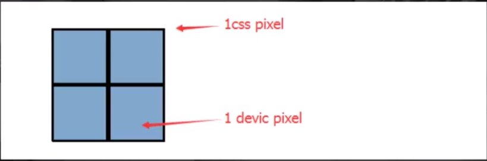
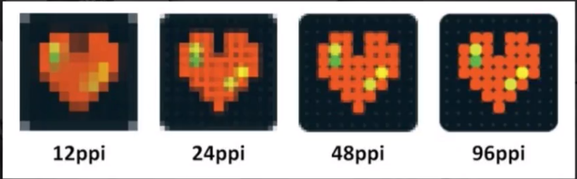
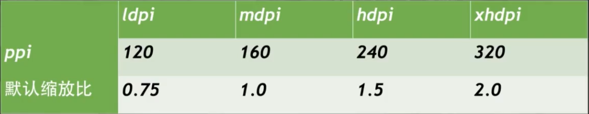
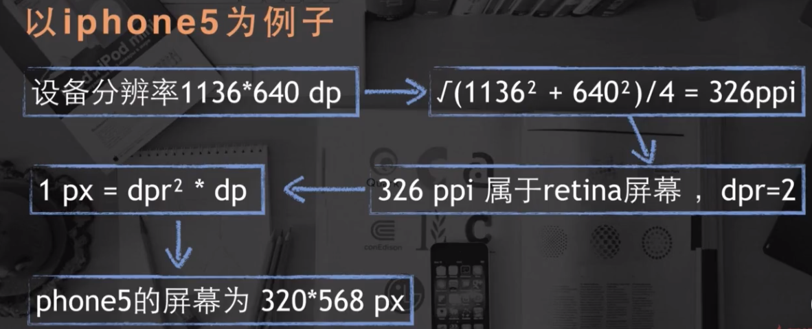

# 移动端web开发知识点

## 目录
1. [基础知识](#1)

   1.1 [pixel像素基础](#1-1)

   1.2 [viewport](#1-2)

2. [常见移动web适配方法](#2)

   2.1 [媒体查询](#2-1)

   2.2 [rem布局](#2-2)
   
3. [响应式布局和弹性布局](#3)

4. [移动web特别样式处理](#4)

   4.1 [高清图片](#4-1)

   4.2 [1像素边框](#4-2)

   4.3 [多行文本溢出](#4-3)

5. [移动端交互](#5)

   5.1 [300ms延迟](#5-1)

   5.2 [touch事件](#5-2)

   5.3 [弹性滚动](#5-3)

## 综述
- 跑在手机端的web页面（H5页面）
- 跨平台
- 基于webview
- 告别ie拥抱webkit
- 更高的适配和性能要求

## <a id="1">一、移动web基础知识</a>

#### <a id="1-1">1.1 *pixel像素基础*</a>
- px: css pixels 逻辑像素， 浏览器使用的抽象单位
- dp,dt: device independent pixels 设备无关像素
- dpr: devicePixelRatio 设备像素缩放比

计算公式： **1px = (dpr)^2 * 1dp**

当dpr等于2的情况



平面上： 1px = (2)^2 * 1dp
维度上： 1px = 2* 1dp

- DPI：打印机每英寸可以喷的墨汁点(印刷行业) 
- PPI: 屏幕每英寸的像素数量，即单位英寸内的像素密度

在计算机显示设备参数描述上，二者意思相同

计算公式：以ipone5为例(1136*640, 4英寸)
ppi = √(1136^2 + 640^2) / 4 = 326ppi(视网膜Retina屏) 单位为硬件像素，非px



ppi越高，像素数越高，图像越清晰



retina高清屏的dpr都是大于等于2
eg: iphone5的ppi为326大于320，所以iphone5的dpr等于2



#### <a id="1-2">1.2 *viewport*</a>
layout viewport = document.documentElement.clientWidth(移动设备默认viewport)

visual viewport = window.innerWidth(浏览器可视区域大小)

ideal viewport = device-width
```html
<meta name="viewport" content="width=device-width,initial-scale=1,user-scalable=no">
```
**最佳实践：layout viewport = visual viewport = device-width**
- width: 设置布局viewport的特定值('device-width')
- initial-scale: 设置页面的初始缩放
- minimum-scale: 最少缩放 
- maximum-scale: 最大缩放
- user-scalable: 用户能否缩放

设计方案
1. 根据设备的实际宽度来设计（常用）
2. initial-scale设为0.5，此时物理像素dp等于抽象像素px，1像素边框和高清图片都不需要额外处理

**[移动前端开发之viewport的深入理解](http://www.cnblogs.com/2050/p/3877280.html)**

## <a id="2">二、常见移动web适配方法</a>
- 定高，宽度百分比
- [flex布局](http://www.ruanyifeng.com/blog/2015/07/flex-grammar.html)
- Media Query(媒体查询)

#### <a id="2-1">2.1 *Media Query*</a>
```css
@media 媒体类型 and (媒体特性) {
    /* css样式 */
}
```
- 媒体类型：screen(屏幕), print(打印机), handheld(手持设备), all(通用)
- 媒体特性：max-width, min-width, max-height, min-height, device-width, device-height, orientation:landscape(横向) portrait(纵向)

#### <a id="2-2">2.2 *rem*</a>
> font size of the root element

> 1rem = html的font-size

首先以设计稿的屏幕大小设置html的font-size，然后网页各处（元素尺寸、文字大小）根据此font-size来设置大小，使用rem作为单位，
随后搭配媒体查询或JS，根据屏幕的大小来动态控制html元素的font-size，当html的font-size改变，其他元素的大小也会跟着改变
```css
@media screen and (max-width: 360px) and (min-width: 321px) {
        html {
            font-size: 20px;
        }
    }
@media screen and (max-width: 320px) {
    html {
        font-size: 24px;
    }
}
```
```js
var htmlWidth = document.documentElement.clientWidth || document.body.clientWidth
var htmlDom = document.getElementsByTagName('html')[0]
// 除以多少自行确定
htmlDom.style.fontSize = htmlWidth / 10 + 'px'
// 页面大小改变时，动态改变html的font-size，从而改变页面内容样式
window.addEventListener('resize', ()=> {
    var htmlWidth = document.documentElement.clientWidth || document.body.clientWidth
    htmlDom.style.fontSize = htmlWidth / 10 + 'px'
})
```
## <a id="3">三、响应式布局和弹性布局</a>
响应式布局：一个页面在不同屏幕不同终端上都能显示出令人满意的效果，页面的布局大小和内容在不同屏幕下都有不同样式
弹性布局：类似于自适应布局，在不同屏幕宽度下，页面内容大小随之等比例缩放，页面布局内容不发生改变

#### 3.1 响应式布局设计点
1. meta设置
   ```html
   <meta name="viewport" content="width=device-width,initial-scale=1,maximum-scale=1,user-scalable=no">
   <meta name="applicable-device" content="pc,mobile">
   <meta http-equiv="Cache-Control" content="no-transform ">
   <meta http-equiv="X-UA-Compatible" content="IE=edge,chrome=1">
   <meta name="HandheldFriendly" content="true">
   ```
2. 使用百分比布局(当没有命中媒体查询时，页面也能正常展示)
3. 弹性图片
   ```css
   #wrapper img {
       max-width: 100%;
       height: auto;
   }
   ```
   图片会根据wrapper的大小来改变宽度，height为auto保证图片不会失真
   如果为背景图片，可设置图片的background-size属性
   ```css
   .background-img {
        background-img:url(img.png);
        background-repeat:no-repeat;
        background-size:100% 100%;
   }
   ```
    background-size是css3的新属性，用于设置背景图片的大小，有两个可选值，第一个值用于指定背景图的width,第2个值用于指定背景图的height,如果只指定一个值，那么另一个值默认为auto。
    background-size:cover; 等比扩展图片来填满元素
    background-size:contain; 等比缩小图片来适应元素的尺寸
3. 重新布局，显示与隐藏
    - 同比例缩减元素尺寸（百分比，rem，em)
    - 调整页面结构布局（*经常切换位置的元素使用 ***绝对定位***，减少重绘提高渲染性能*
    - 隐藏冗余的元素

[静态布局、自适应布局、流式布局、响应式布局、弹性布局等的概念和区别](https://www.cnblogs.com/yanayana/p/7066948.html)

[响应式布局总结](https://www.cnblogs.com/dreamsboy/p/5656009.html)

## <a id="4">四、移动web特别样式处理</a>

#### <a id="4-1">4.1 高清图片</a>
在移动web页面渲染图片，为了避免图片产生模糊，图片的宽高应该用物理像素单位渲染，即100*100的图片
```css
width: (100/dpr) px; 
height: (100/dpr) px;
```

#### <a id="4-2">4.2 1像素边框</a>

在retina屏下会模糊，因为设置的1px使用了2dp渲染

[解决方法](https://segmentfault.com/a/1190000007604842)：scale(.5)等

#### <a id="4-3">4.3 多行文本溢出</a>
```css
/* 单行文本溢出 */
.inaline {
   overflow: hidden;
   white-space: nowrap;
   text-overflow: ellipsis;
}

/* 多行文本溢出 */
.intwoline {
    display: -webkit-box !important;
    overflow: hidden;
    text-overflow: ellipsis;
    word-break: break-all;
    -webkit-box-orient: vertical;
    /* 文本行数 */
    -webkit-line-clamp: 2
}
```

## <a id="5">五、移动端交互</a>

#### <a id="5-1">5.1 300ms延迟</a>
为了确定用户是"单击"还是"双击"，设置300ms延迟来判断

解决方法：自定义tap事件：在touchstart、touchend时记录时间、手指位置，在touchend时进行比较，如果
手指位置为同一位置（或允许移动一个非常小的位移值）且时间间隔较短（一般认为是200ms)，且过程中未曾触发过touchmove，即可认为触发了手持设备的'click'。（会有点透的bug)

**使用zepto.js库或者使用fastClick库**

#### <a id="5-2">5.2 touch事件</a>
- touchstart: 手指触摸屏幕触发（已经有手指放屏幕上不会触发）
- touchmove：手指在屏幕滑动，连续触发
- touchend：手指离开屏幕时触发
- touchcancel：系统取消touch时候触发

触摸事件包含专有的触摸属性
- touches: 当前屏幕所有触摸点的列表
- targetTouches: 当前对象所有触摸点的列表
- changedTouches: 引发当前事件所有触摸点的列表
1. 用一个手指接触屏幕，触发事件，此时这三个属性有相同的值。

2. 用第二个手指接触屏幕，此时，touches有两个元素，每个手指触摸点为一个值。当两个手指触摸相同元素时，
targetTouches和touches的值相同，否则targetTouches 只有一个值。changedTouches此时只有一个值，
为第二个手指的触摸点，因为第二个手指是引发事件的原因

3. 用两个手指同时接触屏幕，此时changedTouches有两个值，每一个手指的触摸点都有一个值

4. 手指滑动时，三个值都会发生变化

5. 一个手指离开屏幕，touches和targetTouches中对应的元素会同时移除，而changedTouches仍然会存在元素。

6. 手指都离开屏幕之后，touches和targetTouches中将不会再有值，changedTouches还会有一个值，
此值为最后一个离开屏幕的手指的接触点。

每个touch对象包含属性:
- clientX: 触摸目标在视口的x坐标
- clientY: 触摸目标在视口的y坐标
- identifier: 表示触摸的唯一id
- pageX: 触摸目标在页面中的x坐标（包含滚动）
- pageY: 触摸目标在页面中的y坐标（包含滚动）
- screenX: 触摸目标在屏幕中的x坐标
- screenY: 触摸目标在屏幕中的y坐标
- target: 触摸的dom节点目标

#### <a id="5-3">5.3 弹性滚动</a>
局部滚动开启弹性滚动
```css
body {
    overflow: scroll;
    -webkit-overflow-scrolling: touch;
}
```
android不支持原生弹性滚动，可使用iscroll或Better-scroll库


